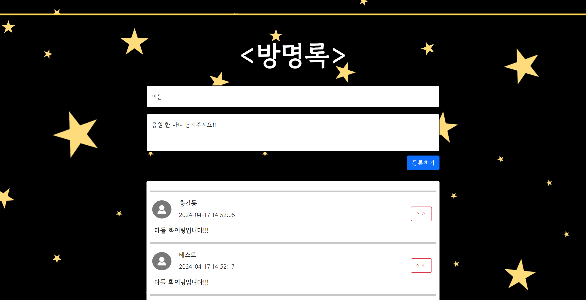

# 🖥️ Team 9to9의 팀 소개 페이지 프로젝트


## 프로젝트 소개
- 저희 프로젝트의 이름은 정시퇴근입니다.
- 이 프로젝트를 기반으로 정시퇴근하는 삶을 지향하지는 의미입니다.
- 이 프로젝트는 팀과 팀원들을 소개하는 페이지를 구현하는 미니 프로젝트 입니다.
- 시연 영상 : [https://youtu.be/xNCu4vm39ks?si=bw1MrqOeRJJSE9Pj](https://youtu.be/xNCu4vm39ks?si=bw1MrqOeRJJSE9Pj)

<br>

## 팀원 구성
- 팀장 : 김정찬 [@jkc-mycode](https://github.com/jkc-mycode)
- 팀원 : 홍성빈 [@rodlsdyd](https://github.com/rodlsdyd)
- 팀원 : 엄혜인 [@Eomhyein](https://github.com/Eomhyein/)
- 팀원 : 이장현 [@JHLee0891](https://github.com/JHLee0891)
- 팀원 : 박순호 [@shpark694576](https://github.com/shpark694576/)

<br>

## 1. 개발 기간
- 2024.04.15 ~ 2024.04.19

<br>

## 2. 개발 환경
- FrontEnd : HTML, CSS, JavaScript, Bootstrap
- BackEnd : Firebase

<br>

## 3. 역할 분배
- **김정찬**
  - 와이어 프레임 구상 및 구현
  - 개인 페이지 제작
  - 댓글 기능 구현
- **홍성빈**
  - 메인 페이지 UI 구상
  - 개인 페이지 구현
- **엄혜인**
  - 메인 페이지 UI 구상
  - 개인 페이지 구현
- **이장현**
  - 모달 코드 분리 구상 및 구현
  - 개인 페이지 구현
- **박순호**
  - 메인 페이지 내용 구상
  - 개인 페이지 구현

<br>

## 4. 와이어 프레임


<br>

## 5. 주요 기능
### 5-1. 댓글 기능
- 파이어베이스가 제공하는 함수를 기반으로 구현
- 원래는 모달 창 하단에 만들려고 구상함
- 하지만 각 페이지마다 스타일 설정에서 문제 발생
- 결국 메인 페이지 하단에 구현 함
- 댓글 작성하기
    ```javascript
    // 댓글 등록하는 버튼 클릭 시 동작
    $("#comment_upload_btn").click(async function () {
        let commenter = $('#floatingInputName').val();
        let content = $('#floatingTextarea2Content').val();

        // 댓글 입력 유효성 검사
        if (commenter != '' && content != '') {
            let date = new Date();
            let isDelete = false;
            let doc = {
                'commenter': commenter,  // 댓글 작성자
                'content': content,  // 댓글 내용
                'date': date,  // 댓글 작성 날짜(시간)
                'isDelete': isDelete,  // 삭제된 댓글 유무
            };
            await addDoc(collection(db, "9to9_Team_Intro"), doc);
            alert('등록완료!');
            window.location.reload();
        } else {
            alert("이름 또는 내용이 비었습니다.");
        }
    });
    ```
- 댓글 가져오기
    ```javascript
    // 파이어베이스에서 데이터 가져오는 forEach문 (날짜 순으로 정렬해서 가져옴)
    let docs = await getDocs(query(collection(db, "9to9_Team_Intro"), orderBy("date")));
    docs.forEach((doc) => {
        let row = doc.data();

        // isDelete가 false일 때 댓글 출력
        if (row['isDelete'] == false) {
            let commenter = row['commenter'];
            let content = row['content'];
            let date = row['date'].toDate();

            // 날짜, 시간 포맷 변경하기
            let year = date.getFullYear();
            let month = ('0' + (date.getMonth() + 1)).slice(-2)
            let days = ('0' + date.getDate()).slice(-2)
            let hours = ('0' + date.getHours()).slice(-2)
            let minutes = ('0' + date.getMinutes()).slice(-2)
            let seconds = ('0' + date.getSeconds()).slice(-2)

            let day = year + '-' + month + '-' + days + " " + hours + ":" + minutes + ":" + seconds
            
            let html_temp = `
                <hr class="border border-dark border-2" style="width: 100%;">
                <div class="comment">
                    <div class="comment_left">
                        <div class="commenter_info">
                            
                            <div class="commenter_and_time">
                                <p class="commenter" style="font-weight: bold">${commenter}</p>
                                <p class="comment_time">${day}</p>
                            </div>
                        </div>
                        <div class="comment_content">
                            <p style="font-weight: bold">${content}</p>
                        </div>
                    </div>
                    <div class="comment_right">
                        <!-- 댓글들을 구분하기 위해서 파이이베이스 각 필드의 id 값을 value에 넣어줌 -->
                        <button value=${doc.id} type="button" class="btn btn-outline-danger comment_delete_btn">삭제</button>
                    </div>
                </div>
                `

            $('#comment_list').append(html_temp);
        }
    });
    ```
- 댓글 삭제하기
- 파이어베이스에서 데이터를 직접 삭제하는 대신에 플래그 변수를 사용
    ```javascript
    // 데이터베이스의 데이터를 지우는 것이 아닌 isDelete를 플래그로 사용
    $('#comment_list').on('click', '.comment_delete_btn', async function() {
        if (confirm("댓글을 삭제하시겠습니까?")) {
            await updateDoc(doc(db, '9to9_Team_Intro', $(this).val()), {
                isDelete : true,
            })
            alert("삭제되었습니다.");
            window.location.reload();
        }
    });


    // // 데이터베이스에서 직접 필드를 삭제하는 코드
    // $('#comment_list').on('click', '.comment_delete_btn', async function() {
    //     if (confirm("댓글을 삭제하시겠습니까?")) {
    //         await deleteDoc(doc(db, '9to9_Team_Intro', $(this).val()));
    //         alert("삭제되었습니다.");
    //         window.location.reload();
    //     }
    // });
    ```

<br>

### 5-2. 모달(Modal) 창 연결
- 부트스트랩의 코드를 가져와서 사용
- 이 때 주의할 점은 각 모달마다 data-bs-target과 ID를 동일하게 맞춰야 함
  ```html
  <button class="about btn btn-outline-warning" data-bs-toggle="modal" data-bs-target="#exampleModal1">더 보기</button>

  ....

  <div class="modal fade" id="exampleModal1" tabindex="-1" aria-labelledby="exampleModalLabel" aria-hidden="true">
    ...
  </div>
  ```

<br>

## 6. 페이지 사진 첨부





<br>

## 7. 어려웠던 점
### 7-1. 코드 분리의 어려움 (김정찬)
- 초반에 코드 및 파일 분리를 제대로 기획하지 못해서 각자가 똑같은 파일을 복사해서 가져가서 작업 함
- 복사된 파일을 가져가서 작업 후 깃허브로 올리면 한 사람이 직접 코드를 병합하는 방식을 사용함
- class 명이나 ID가 겹쳐서 스타일이 깨지는 경우가 많이 발생함
- 특히 프로젝트 규모가 작다보니 코드나 파일의 분리가 어려웠음


### 7-2. 댓글 기능을 모달 창에 넣기 (김정찬)
- 처음 구상은 댓글 기능을 각자의 모달 창에 넣어서 댓글을 따로 보고 작성할 수 있도록 만들 예정이었음
- 하지만 댓글 기능을 구현하고 각자의 모달 창에 넣어보니 각자의 규격에 맞도록 댓글 구역을 수정해야 하는 문제가 발생함
- 댓글 리스트는 하나의 스크립트 파일로 일정한 형식의 HTML로 가져오기 때문에 각자에 맞도록 수정하려면 인원수 만큼의 코드가 필요함 
- (근데 지금 생각해보면 class를 여러개 사용해서 따로 구현할 수 있지 않았을까 생각함)
- 댓글의 CRUD 는 파이어베이스에서 직접 제공하고 있기 때문에 간편하게 구현이 가능함


### 7-3. 모달창 안에서 레이어 구분 나누기 (홍성빈)
- 모달 창 규격 안에서 class 사용해 구간을 나눠놓고 사용해야함
- 그밖을 벗어나서 임의로 position 기능을 이용할때마다 각자 모니터 마다 배치가달라짐
